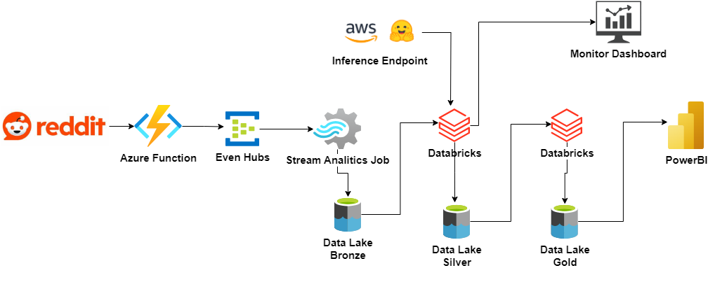

# Delta Table Streaming

Este repositorio contiene notebooks databricks (.py) y notebooks para el análisis y procesamiento de datos de streaming de post de reddit usando Delta Lake.

## Arquiectura de la solución

La Azure Function se utiliza para consumir la API de Reddit y evaluar nuevos posts, simulando un flujo de datos. Event Hubs recibe los eventos y, a través de un job de Stream Analytics, los JSON se almacenan en una tabla Delta en el Data Lake. Con Databricks se evalúa cada ventana de datos de 1000 posts usando una UDF que evalúa cada post con el endpoint del modelo. Los resultados y la data agregada se almacenan en una tabla Delta de la zona Silver. Posteriormente, se evalúa y consolida la tabla para obtener resultados importantes que se visualizan en un tablero de Power BI.

## Notebooks

- [EDA_trainig_data.ipynb](https://github.com/AndresR2909/poc_delta_table_streaming/blob/main/EDA_trainig_data.ipynb): Este notebook demuestra varios pasos de exploración y preprocesamiento de datos, incluyendo la tokenización, análisis de frecuencia y técnicas de visualización usando bibliotecas de Python como NLTK, Pandas, Matplotlib y Seaborn.

## Notebooks Databricks

- [EDA_data_reddit.py](https://github.com/AndresR2909/poc_delta_table_streaming/blob/main/EDA_data_reddit.py): Este script se conecta a las zonas del datalake, carga una tabla de muestra de streaming para análisis de datos, y realiza varias operaciones de filtrado, agrupación y creación de tablas en PySpark.
- [explore_data_xgboost.py](https://github.com/AndresR2909/poc_delta_table_streaming/blob/main/explore_data_xgboost.py): Este script se conecta al datalake, carga una tabla de muestra de streaming, limpia los datos, cuenta tokens y posts, y aplica modelos a los posts.
- [explore_data_bert.py](https://github.com/AndresR2909/poc_delta_table_streaming/blob/main/explore_data_bert.py): Este script se conecta al datalake, carga una tabla de muestra de streaming, limpia los datos, cuenta tokens, y aplica modelos a los posts.
- [stream_data_lake.py](https://github.com/AndresR2909/poc_delta_table_streaming/blob/main/stream_data_lake.py): Este script crea un DataFrame de streaming que lee de la tabla Delta, aplica funciones UDF para generar clasificaciones y contar tokens, y filtra los posts basados en el tiempo.
- [explore_data_llama.py](https://github.com/AndresR2909/poc_delta_table_streaming/blob/main/explore_data_llama.py): Este script se conecta al datalake, carga una tabla de muestra de streaming, limpia los datos, cuenta tokens, y aplica modelos a los posts.
